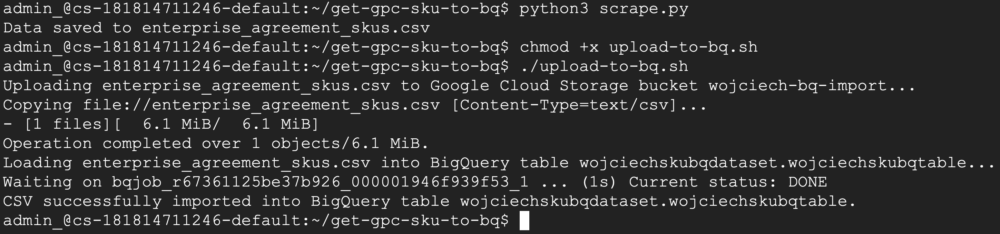
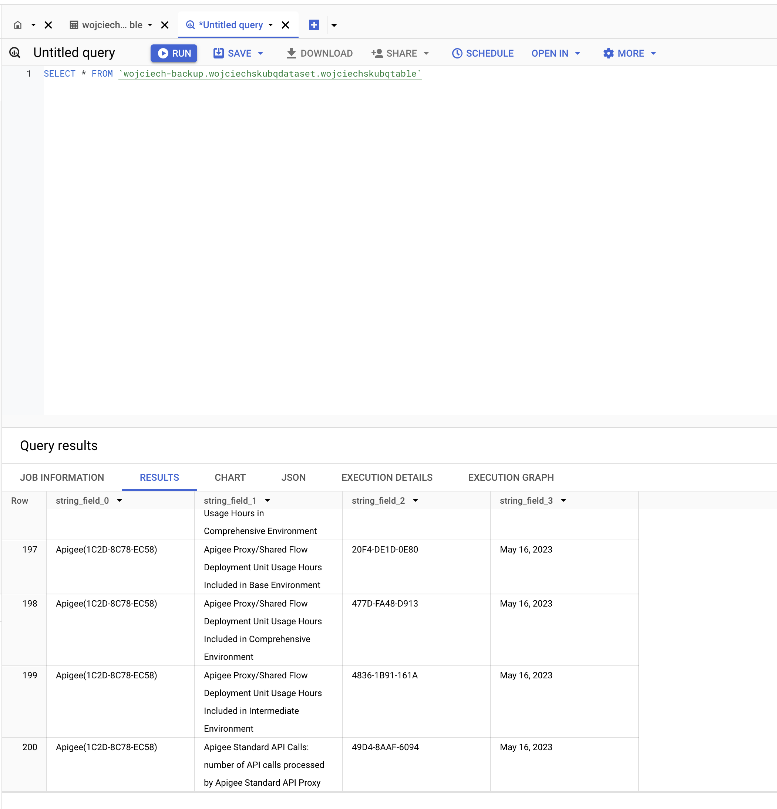

# How to get list of all SKU-IDS from Google Cloud Website and load it into BigQuery

# Step one

At first we will use short python script to get contents of the Google Cloud SKUs. In my case I will use https://cloud.google.com/skus/sku-groups/enterprise-agreement-2021-1 as the source data. If you will access this link you will see a thousands of SKUs.

Before running the script we need to install python requirements first. We can do it with `pip install -r requirements.txt`.

In step one we will use Python script which will parse the URL and save it to CSV file.

Run it as follows `python3 scrape.py`.

## Scrape Script
For details on how the scraping is implemented, refer to the following file:

[scrape.py script details](https://github.com/wojciehm/get-gpc-sku-to-bq/blob/main/scrape.py)

[raw content of scrape.py](https://github.com/wojciehm/get-gpc-sku-to-bq/blob/main/scrape.py)


# Step two
In step two we will use bash script to upload the CSV file into Google Cloud Storage and then we will ingest it into BigQuery. As you see in the variables we need to have Google Cloud project, bucket, dataset and table already pre-created.

```bash
#!/bin/bash

# Variables
PROJECT_ID="your_project_id"
BUCKET_NAME="your_bucket_name"
DATASET_NAME="your_dataset_name"
TABLE_NAME="your_table_name"
CSV_FILE="enterprise_agreement_skus_$(date +%Y-%m-%d_%H-%M-%S).csv"  # Updated filename with date and time

# Scrape data (assuming you have a scraping script or data source to generate this)
# Example: scrape data and save it to a temporary file
SCRAPED_DATA="path/to/scraped_data.csv"  # Replace with the path to your actual scraped CSV

# Move the scraped data to the intended CSV file
mv $SCRAPED_DATA $CSV_FILE

# Upload CSV to Google Cloud Storage
echo "Uploading $CSV_FILE to Google Cloud Storage bucket $BUCKET_NAME..."
gsutil cp $CSV_FILE gs://$BUCKET_NAME/

# Load CSV into BigQuery
echo "Loading $CSV_FILE into BigQuery table $DATASET_NAME.$TABLE_NAME..."
bq load \
  --autodetect \
  --source_format=CSV \
  $PROJECT_ID:$DATASET_NAME.$TABLE_NAME \
  gs://$BUCKET_NAME/$CSV_FILE

# Confirm success
if [ $? -eq 0 ]; then
  echo "CSV successfully imported into BigQuery table $DATASET_NAME.$TABLE_NAME."
else
  echo "Failed to import CSV into BigQuery. Check the logs for details."
fi
```
Of course you need to make shell script executable, it can be done by typing in command `chmod +x upload-to-bq.sh`.

Then run script in your command line environment by running `./upload-to-bq.sh`.



After that we can see that data is uploaded to BigQuery and can be analyzed :)



Voila! :)